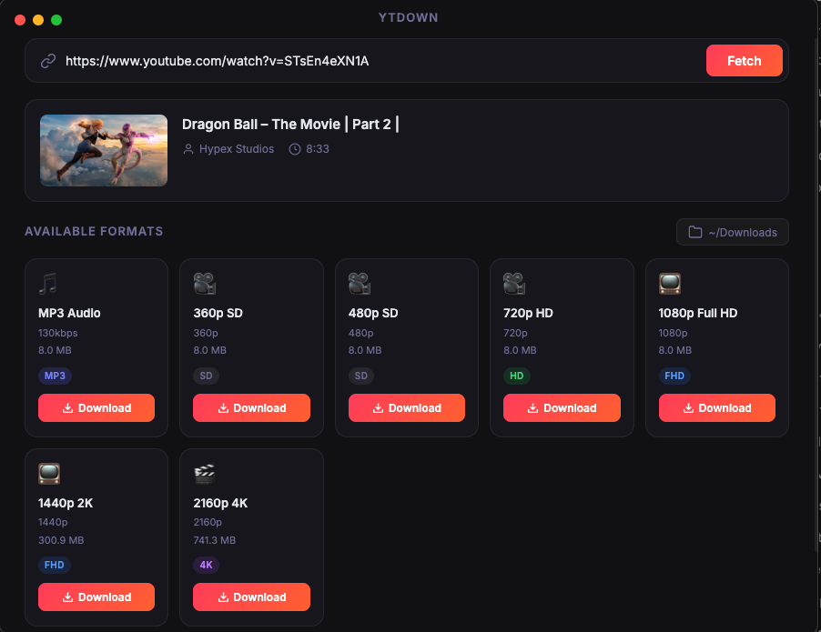

# YTDown 🎬

A lightweight desktop app to download YouTube videos with a modern, dark-themed UI. Built with Electron + yt-dlp.



## Features

- 🔗 **Paste any YouTube URL** — auto-detects and fetches available formats
- 🎵 **MP3 audio** — best quality audio extraction
- 📺 **All video resolutions** — 360p, 480p, 720p HD, 1080p Full HD, 1440p 2K, 4K 60fps
- 📊 **Live progress bar** — real-time download speed, ETA, and file size
- ✨ **Merge animation** — shimmer effect while merging video + audio streams
- 📁 **Custom output folder** — click to change download destination
- 🔍 **Show in Finder** — reveal downloaded file instantly after completion

## Prerequisites

Make sure you have the following installed:

```bash
# Install yt-dlp (required)
brew install yt-dlp

# Install ffmpeg (required for merging video+audio and MP3 conversion)
brew install ffmpeg

# Install Deno (recommended — improves yt-dlp performance)
brew install deno
```

## Installation

```bash
# Clone the repo
git clone https://github.com/yourusername/ytdown.git
cd ytdown

# Install dependencies
npm install

# Run the app
npm start
```

## Usage

1. **Paste** a YouTube URL into the input field (auto-fetches on paste)
2. **Choose** a format from the grid (MP3, HD, FHD, 4K...)
3. **Click Download** — watch the progress bar fill up
4. **Click "Show in Finder"** when done to open the file location

## Tech Stack

| Layer | Technology |
|-------|-----------|
| App framework | [Electron](https://electronjs.org) |
| Download engine | [yt-dlp](https://github.com/yt-dlp/yt-dlp) |
| UI | Vanilla HTML/CSS/JS with Inter font |
| Media merge | ffmpeg (via yt-dlp) |

## Project Structure

```
ytdown/
├── main.js          # Electron main process (yt-dlp integration, IPC handlers)
├── preload.js       # Secure context bridge between main & renderer
├── renderer/
│   ├── index.html   # App HTML shell
│   ├── styles.css   # Dark-themed modern CSS
│   └── app.js       # Renderer UI logic
└── package.json
```

## Notes

- Downloads are saved to `~/Downloads` by default
- For HD/FHD/4K, yt-dlp downloads video and audio separately then merges — this requires ffmpeg
- YouTube may throttle downloads without a JS runtime (Deno fixes this)

## License

MIT
